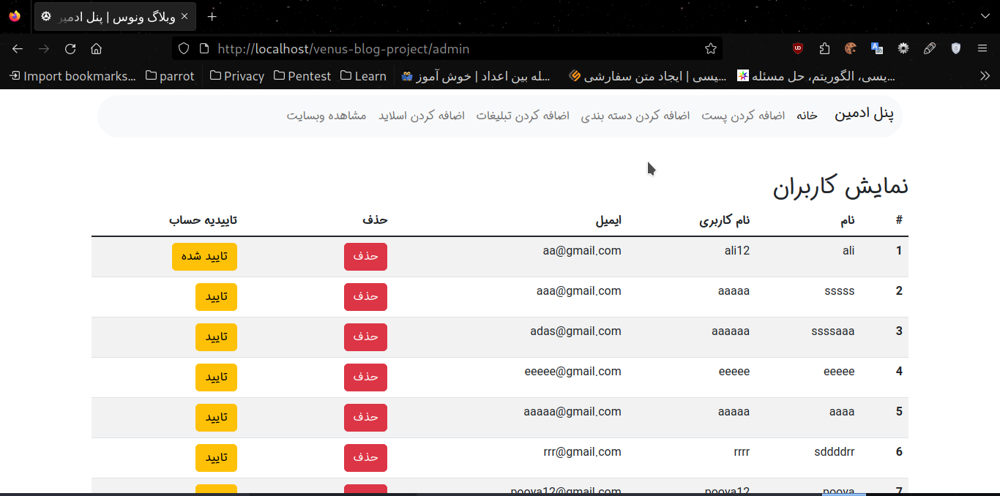
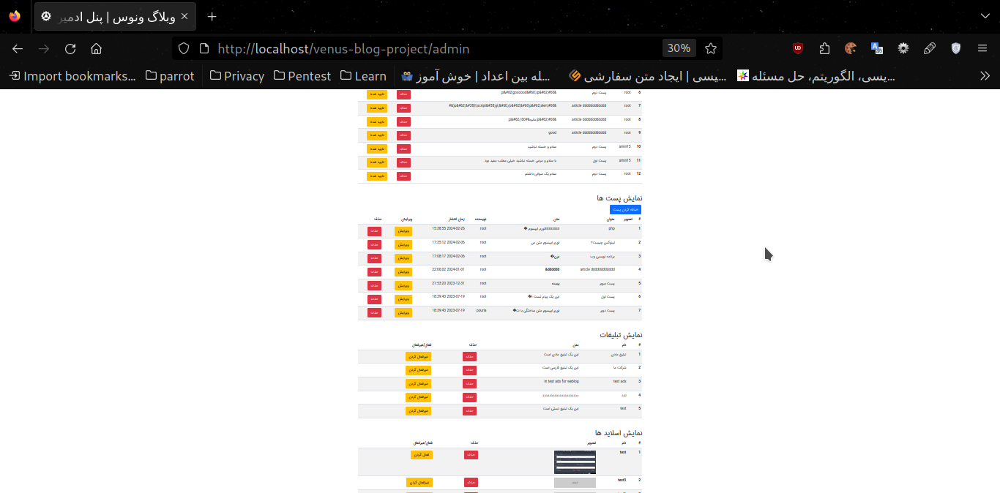
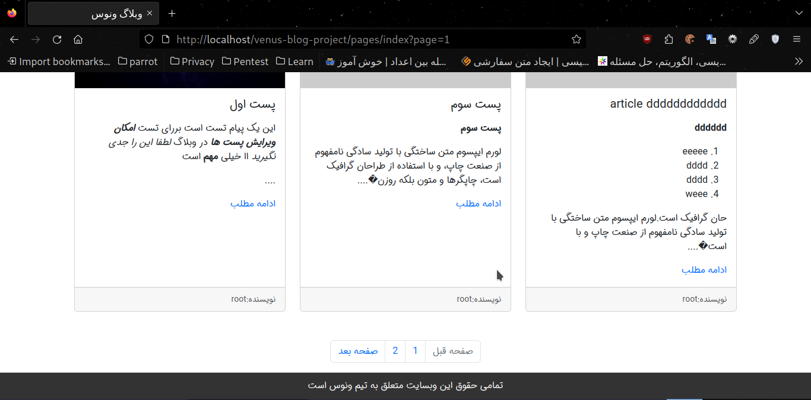

Hello!
This is a simple blog developed using PHP programming language and the architecture of this blog is based on MVC architecture.

You can see the front-end format of this project on the page below!
[Template-project](https://github.com/pouria0015/Venus-Web-Template)

### project features
:pushpin: Has an admin panel

:pushpin: Edit user account

:pushpin: Send user authentication email

:pushpin: Adding ads, posts, and sliders and categorizing content and managing these items in the admin panel

:pushpin: Deleting users or activating and deactivating posts or editing posts

:pushpin: Using jwt token to store data

:pushpin: Manage requests with csrf token

:pushpin: Add comments for posts and displaying them after the administrator's approval

:pushpin: using mysql database

You can see some pictures of the project:

